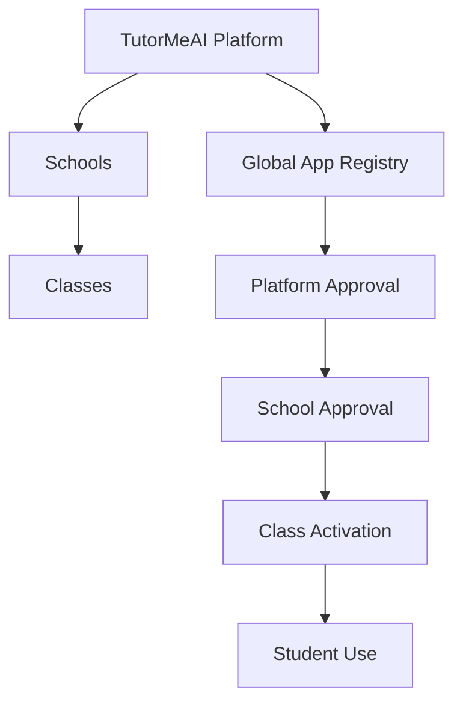

# ChatBridge School Hierarchy Plan

## Purpose

This plan locks in the platform hierarchy, role model, data boundaries, approval chain, and rollout order for ChatBridge as TutorMeAI moves from internal testing into a real school-scoped product.

The main design goal is:

- TutorMeAI owns the platform and the global app registry.
- Schools control what their staff can use.
- Teachers control what their own classes can use.
- Students only see and use apps that are approved all the way down the chain.

## Locked Decisions

- There is no district layer in this model.
- `platform_admin` is a TutorMeAI platform role, not a school role.
- `school_admin` is a school-scoped role.
- Developers submit apps to the global TutorMeAI registry, not directly to a school.
- A class belongs to exactly one school.
- A teacher may teach multiple classes.
- A teacher may only manage apps for classes they teach.
- A student may only use apps that are platform-approved, school-enabled, class-enabled, and available to a class they are enrolled in.

## Hierarchy



## Role Model

### Global Roles

- `platform_admin`
  - TutorMeAI staff
  - reviews app submissions
  - manages platform-wide governance
  - can operate across all schools and classes
- `developer`
  - submits manifests to the global registry
  - views owned apps, versions, and review feedback
  - does not gain school or class governance rights by default

### School-Scoped Membership Role

- `school_admin`
  - manages app availability for one school
  - manages teachers, students, and classes for that school

### Class-Scoped Membership Roles

- `teacher`
  - teaches one or more classes
  - can enable school-approved apps for classes they teach
- `student`
  - belongs to one or more classes
  - can only use apps active for those classes

## Scope Boundaries

### Global Scope

- app registry
- app versions
- review actions
- developer ownership
- platform audit events
- platform-wide policy

### School Scope

- school memberships
- school app approvals
- school-level reporting and configuration

### Class Scope

- class memberships
- class app activation
- active runtime app availability for students and teachers

### User-Owned Scope

- chat sessions
- conversation history
- user profile
- developer-owned app submissions

## Approval and Usage Chain

### 1. Developer Submission

- A developer submits a manifest to the global TutorMeAI registry.
- The submission becomes a pending app version.
- Nothing is visible to schools, teachers, or students yet.

### 2. Platform Approval

- A `platform_admin` reviews the submission.
- If approved, the app becomes eligible for school adoption.
- If rejected or suspended, it cannot be adopted by any school.

### 3. School Approval

- A `school_admin` enables a platform-approved app for their school.
- This does not automatically expose the app to every class.
- It makes the app available for teachers in that school to activate in their own classes.

### 4. Class Activation

- A teacher selects one of the classes they teach.
- The teacher enables the app for that class.
- Only that class receives the app.

Example:

- Mr. Smith teaches `Math 101`, `Math 202`, and `Math 303`
- the school enables `Algebra App`
- Mr. Smith enables it only for `Math 303`
- students in `Math 303` see it
- students in `Math 101` and `Math 202` do not

### 5. Student Use

- A student only sees an app if:
  - the app is platform-approved
  - the app is enabled for the student’s school
  - the app is enabled for the student’s class
  - the student is enrolled in that class

## Data Model

### Core Tables

```text
user_profiles
  user_id
  email
  display_name
  created_at
  updated_at

user_roles
  user_id
  role                  // platform_admin | developer
  assigned_by
  assigned_at
  revoked_at

schools
  id
  name
  created_at
  updated_at

school_memberships
  school_id
  user_id
  role                  // school_admin | teacher | student
  assigned_by
  assigned_at
  removed_at

classes
  id
  school_id
  name
  external_ref
  created_at
  updated_at

class_memberships
  class_id
  user_id
  role                  // teacher | student
  assigned_by
  assigned_at
  removed_at

apps
  app_id
  owner_user_id
  active_version
  ...

app_versions
  app_id
  version
  review_state
  ...

school_app_allowlists
  school_id
  app_id
  enabled_by
  enabled_at
  disabled_at

class_app_allowlists
  class_id
  app_id
  enabled_by
  enabled_at
  disabled_at
```

## Integrity Rules

- Every class belongs to exactly one school.
- A `teacher` class membership must belong to a class inside a school where that user is also a school member.
- A `student` class membership must belong to a class inside a school where that user is also a school member.
- A teacher can only enable apps for classes they teach.
- A school admin can only enable apps for their own school.
- A developer submission is always global and never school-owned.
- A class cannot enable an app unless the school already enabled it.

## Runtime Rules

- The backend is the source of truth for:
  - effective user roles
  - school membership
  - class membership
  - app availability
- The frontend may suggest a current school or class.
- The backend validates whether that school or class is valid for the current user.
- The ChatBridge shelf should be derived from:
  - platform-approved apps
  - intersected with school approvals
  - intersected with class activation
  - intersected with the user’s class memberships

## Frontend Surface Model

### Platform Admin

- global registry review
- version review history
- school visibility across the platform
- role assignment and governance tooling

### School Admin

- school app approval
- school teacher and student management
- class creation and assignment management

### Teacher

- class selector limited to classes they teach
- class app activation for school-approved apps
- class-scoped runtime visibility

### Student

- conversation
- app shelf for enrolled classes only
- no governance controls

### Developer

- owned app submissions
- owned app versions
- review feedback

## Recommended Rollout Order

### Phase 1: Schema and Membership Foundations

- add `schools`
- add `school_memberships`
- add `classes.school_id`
- update `class_memberships`
- add `school_app_allowlists`

### Phase 2: Backend Authorization

- split global roles from scoped memberships
- add backend auth helpers for school and class scope
- enforce route-level permissions

### Phase 3: Governance Chain

- platform approval remains global
- school admin school-level app approval
- teacher class-level activation

### Phase 4: Runtime Exposure

- derive ChatBridge shelf from school and class scope
- validate active school/class on backend
- ensure students only see apps for enrolled classes

### Phase 5: Frontend Surfaces

- platform admin workspace
- school admin workspace
- teacher class activation surface
- student runtime-only experience
- developer global portal

## Acceptance Checklist

- A developer submission enters the global registry only.
- A platform-approved app is not visible to students until a school admin enables it for a school.
- A school-enabled app is not visible to students until a teacher enables it for a class they teach.
- A teacher who teaches multiple classes can enable an app for one class without enabling it for the others.
- A student only sees apps enabled for classes they are enrolled in.
- A school admin cannot manage another school’s data.
- A developer cannot see school or student classroom data by virtue of being a developer.
